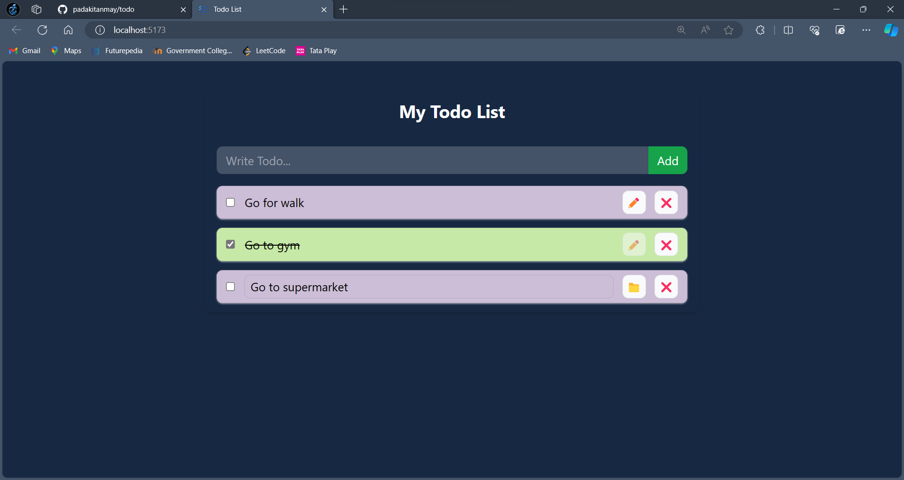

# TodoList App

TodoList App is a simple web application built with React.js that allows users to manage their daily tasks. It utilizes React Context API for state management and local storage for data persistence, ensuring that tasks are saved even after the browser is closed.

## Features

- Add new tasks to the todo list
- Mark tasks as completed
- Delete tasks from the todo list
- Persist tasks in the local storage
- Dark mode support for better visibility

## To run 

- Naviagate to folder and 
``` Javascript
npm run dev
```

## Reference

https://github.com/hiteshchoudhary

## Project Preview


